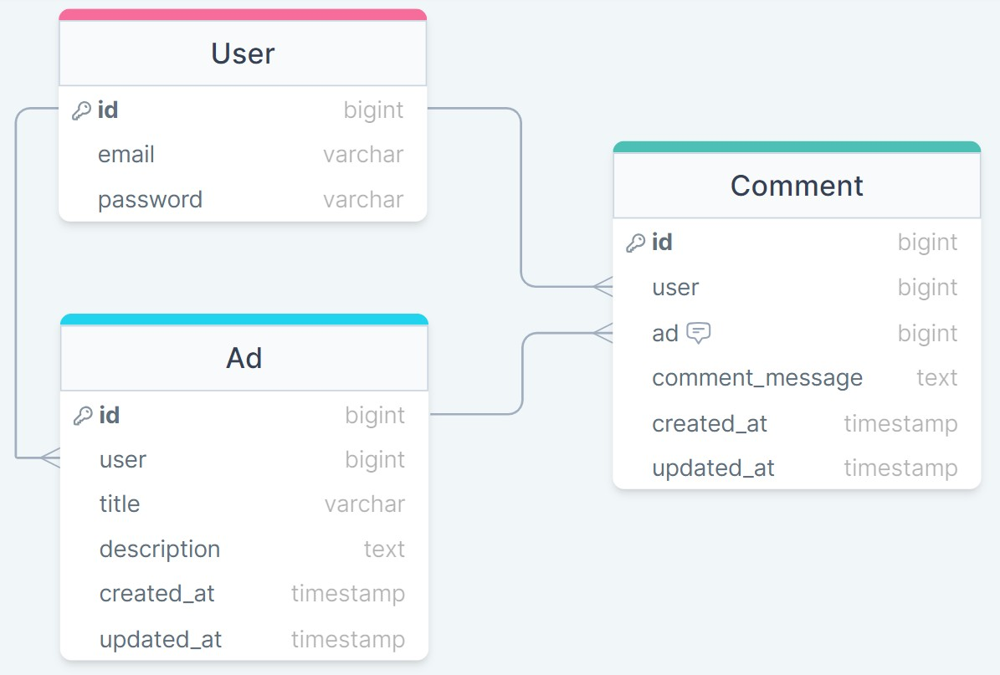
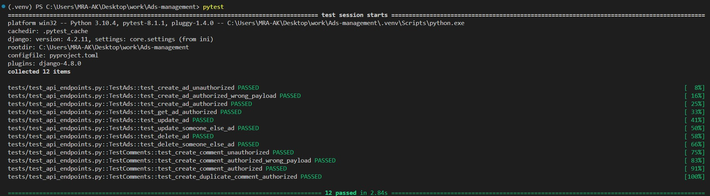

# Ads Posting and Commenting System

## Overview
This project is aimed at creating a platform where users can post advertisements and comment on other people's ads.

## Business Specifications
1. **User Authentication (JWT):** Users are required to authenticate to perform actions such as adding ads and commenting.
1. **User Registration:** Users can register using a unique email as their username and set a password.
1. **Comment Limitation:** Each user can only comment on an ad once.
Public Viewing: Users can browse ads and related comments without the need to log in to the system.
1. **Ad Management:** Users have the ability to delete and edit their own ads.

## Technical Specifications
1. **RESTful API:** This project is implemented with Django and DRF.
1. **Database:** PostgreSQL will serve as the database management system.
1. **Object-Relational Mapping (ORM):** ORM will be utilized to simplify interactions with the database.
1. **API Testing:** Comprehensive tests is written to ensure the reliability and correctness of our APIs.
1. **OpenAPI Specification:** The API documentations are compatible wiht OpenAPI specifications.
1. **README Setup:** A detailed README file will guide users through the setup and running of the project.
1. **Version Control:** The codes hosted on a public repository on Git + GitHub for version control, with regular commits to track changes.
1. **Code Quality and Linting**: The code quality is checked with isort, black, and flake8 to ensure they are based on PEP8 principles.


### Installation
1. **Clone the repository:**
    ```bash
    # If using HTTPS:
    git clone https://github.com/MRA-AK/Ads-management.git
    # If using SSH:
    # git clone git@github.com:MRA-AK/Ads-management.git
    cd Ads-management
    ```

2. **[Optional] Set up and activate a python virtual environment:**
    ```bash
    python -m venv .venv
    source .venv/bin/activate  # On Windows use `.venv\Scripts\activate`
    ```

3. **Install dependencies:**
    ```bash
    pip install -r requirements.txt
    ```

4. **Create PostgreSQL database:**
    Create a new database.

5. **Set up environment variables:**
    Create a `.env` file in the root directory and add the following:
    ```bash
    SECRET_KEY="DJANGO_SECRET_KEY"
    DB_NAME="DB_NAME"
    DB_USER="DB_USER"
    DB_PASSWORD="DB_PASSWORD"
    ```
    > [!NOTE]  
    > You can use `.env.sample` as a sample.

6. **Apply migrations (Create tables):**
    ```bash
    python manage.py migrate
    ```

7. **[Optional] Create a super user:**
    ```bash
    python manage.py createsuperuser
    ```

8. **Run Django:**
    ```bash
    python manage.py runserver
    ```


## Usage
Access the API documentation at [localhost:8000/swagger/](http://localhost:8000/swagger/) for Swagger UI or [localhost:8000/redoc/](http://localhost:8000/redoc/) for ReDoc.


## Database ERD



## Run Tests
   ```bash
   pytest .
   ```



## Improvements and Next Steps
1. **Dockerize Project (If needed):** Containerize the application using Docker to simplify deployment and ensure consistency across different environments.
1. **More Tests:** Expand the test suite to include more comprehensive unit tests, integration tests, and end-to-end tests.
1. **Rate Limiting:** Add rate limit on critical endpoints to prevent abuse and ensure the API's stability and reliability, especially under high load.
1. **Logging System:** Implement a logging system to capture different levels of logs (info, warning, error, etc.). This helps in monitoring, debugging, and ensures traceability of actions and errors.
1. **Changelog:** Add a CHANGELOG to track all project changes.
1. **Git Hooks:** Use git hooks i.e. pre-commit and pre-push hooks to ensure consistency and automatically check commits and messages based on ParsTasmim conventions.
1. **Add CI/CD Enhancements:** Add CI/CD pipeline for automated testing, building, and deployment processes. Consider adding stages for code quality checks, security scans, and automated deployment to staging/production environments.


## Contact
Mohammad Reza Akbari - mra1373@gmail.com

Project Link: [github.com/MRA-AK/Ads-management](https://github.com/MRA-AK/Ads-management)
